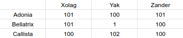

SAE S2.02 -- Rapport pour la ressource Graphes
===
*CANCEL Paul, KELLER Arthur et SOULIEZ Gaspard*

Version 1
---

### Étude d'un premier exemple

Les appariemets acceptables pour les données de l'exemple 1 :

* Adonia, A -- Xolag, X
* Adonia, A -- Zander, Z
* Adonia, A -- Yak, K
* Bellatrix, B -- Xolag, X
* Bellatrix, B -- Zander, Z
* Callista, C -- Xolag, X
* Callista, C -- Yak, Y
* Callista, C -- Zander, Z

Expliquer l'apparaiment optimal est Bellatrix--Xolag, Adonia--Zander, et Callista--Yak. Pas en parlant du graphe mais en parlant des problemes (hobbies, animaux ...).

Pour commencer nous allons regarder le cas de Bellatrix car elle est allergique aux animaux donc elle ne peut pas être avec Yak car il a un animal. Ses hobbies sont la culture et la science. Le seul hôte qui convient est donc Xollag car il n'a pas d'animaux et a comme hobbies la culture. Ensuite pour le cas de Adonia qui n'est pas allergique au animaux et qui a comme hobbies le sports et la technologie et il reste Zander et Yak comme hôte. Celui qui convient le mieux est Zander car il a comme hobbies la technologie. Pour finir Callista et Yak vont ensemble et ca tombe bien car ils ont leur deux hobbies en commun qui sont la science et la lecture. 

### Modélisation de l'exemple

Image du graphe plus explicaction des branches

Dans l'exemple ci-dessus :
- Les poids qui ont 100 veulent dire que les adolescents ont 0 de loisirs en commun.
- le poids des arrétes qui sont à 101 signifient que les adolescents ont 1 loisir de commun.
- le poids des arrétes qui sont à 102 signifient que les adolescents ont 2 loisir de commun.
- Les poids qui sont à moins de 100 signifient qu'il y a une incompatibilité entre les adolescents. 

### Modélisation pour la Version 1

Nous avons decider de mettre un poids de depart entre chaque adolescents de 0. On ajoute un poids de 100 quuand il y a une compatibilité. En ce qui concerne les activités en commun nous ajoutons un poids de 1 pour une activité en commun entre chaque adolescent. 

### Implémentation de la Version 1

(voir [AffectationUtil.java](../src/Graphe/AffectationUtil.java))

(voir [AffectationUtilTest.java](../test/App/AffectationUtilTest.java))

Version 2
---

### Exemple minimal pour la gestion de l'historique

Exemple : 

* Albert, A -- Yakari, Y
* Chloe, C -- Zoe, Z
* Bertrand, B -- Xavier, X
* Daniel, D -- Wallyde, W

- Albert = "same" | Yakari = "same"
- Chloe = "other" | Zoe = "other"
- Bertrand = ""   | Xavier = "other"
- Daniel = "same" | Wallyde = ""

"same" = ne veut pas changer de correspondant

"other" = veut changer de correspondant

"" = n'a pas spécifier.

L'appariement optimal qui prend en compte les données d'historique est le suivant :

* Albert, A -- Yakari, Y
* Bertrand, B -- Zoe, Z
* Chloe, C -- Xavier, X
* Daniel, D -- Wallyde, W

L'appariement optimal est celui décrit ci-dessus, car il respecte au maximum les demandes de chaque personne. Albert et Yakari ont spécifié qu'ils souhaitaient rester ensemble, nous les avons donc regroupés. Chloe a spécifié "other", nous avons donc changé son correspondant et l'avons associée à Xavier, qui a également spécifié "other" et a donc également changé de correspondant. Pour Zoe, qui a spécifié "other" et ne souhaitait pas être à nouveau avec Chloe, nous l'avons associée à Bertrand, qui n'avait pas de préférence spécifique. Enfin, nous avons Daniel, qui a spécifié "same" et était initialement avec Wallyde, qui n'a pas de demande spécifique.

### Deuxième exemple pour la gestion d'historique

- Albert "same" "sports,technology"
- Bertrand "" "culture,science"
- Chloe "other" "science,reading"
- Daniel "same" "technology"
- Wallyde "" "culture, technology"
- Xavier "other" "science, reading"
- Yakari "same" "sport"
- Zoe "other" "culture, reading"

Nous avons pris en compte les hobbies de chaque personne, en plus de l'historique des appariements, dans le processus d'affectation. Cependant, malgré l'ajout des hobbies, les affectations ne changent pas car l'historique reste le critère principal pris en compte. Les hobbies ont été considérés comme un facteur supplémentaire dans la gestion des appariements, mais ils n'ont pas eu d'impact sur les affectations finales.

* Albert, A -- Yakari, Y
* Bertrand, B -- Zoe, Z
* Chloe, C -- Xavier, X
* Daniel, D -- Wallyde, W

Ci-dessus l'affectations optimal en prenant en compte l'historique et les hobbies.

### Modélisation pour les exemples

.png)

.png)

### Modélisation pour l'historique de la Version 2

Nous avons décidé d'attribuer un poids initial de 0 entre chaque adolescent. Si les adolescents ne sont pas compatibles, nous ajoutons un poids de 100, tandis que s'ils sont compatibles, nous laissons le poids à 0. En ce qui concerne les hobbies, nous ajoutons un poids de -1 pour chaque hobby en commun.

Voici comment cela se reflète sur le graphe :

* Un poids de 100 indique qu'ils ne sont pas compatibles (non respect du critère d'historique).
* Un poids de -1 indique qu'ils sont compatibles (respect du critère d'historique) et qu'ils ont un hobby en commun.
* Un poids de -2 indique qu'ils sont compatibles (respect du critère d'historique) et qu'ils ont deux hobbies en commun.

### Implémentation de l'historique de la Version 2

Pour prendre en compte le critère d'historique, nous avons ajouté la méthode **weightHistory** à la classe [AffectationUtil.java](../src/Graphe/AffectationUtil.java). Cette méthode nous permet de gérer le graphe en intégrant le critère d'historique.

De plus, nous avons ajouté un paramètre nommé **WEIGHT_HISTORY** à la classe [AffectationUtil.java](../src/Graphe/AffectationUtil.java) afin de contrôler les poids de la méthode **weightHistory**.

### Test pour l'historique de la Version 2

(voir [AffectationUtilTest.java](../test/App/AffectationUtilTest.java))

### Prendre en compte les autres préférences

*Pour chacun des autres critères d'affinité que vous décidez de prendre en compte, décrire comment vous changez la fonction weight de la classe AffectationUtil.*

(voir [AffectationUtil.java](../src/Graphe/AffectationUtil.java))

### L'incompatibilité en tant que malus